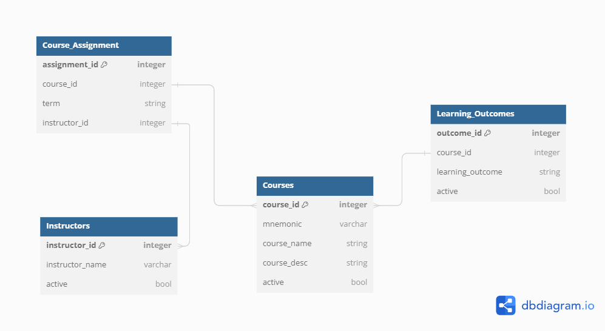

# Database Design and Build - Part 1

## Design Questions

### 1) What tables should you build? 
I will be creating 4 different tables:  
- **Courses_db**: Contains course information such as name, description active status, and mnemonic.  
- **Instructors_db**: Contains instructor information such as name and active status.  
- **Learning_Outcomes_db**: Contains learning outcomes for each course.  
- **Course_Assignment_db**: Contains what courses are being offered for different terms and who the instructor is.  
      
### 2) For each table, what field(s) will you use for primary keys?  
Primary Keys for each table:  
- **Courses_db**: course_id
- **Instructors_db**: instructor_id
- **Learning_Outcomes_db**: outcome_id
- **Course_Assignment_db**: assignment_id

### 3) For each table, what foreign keys will you use?  
Foreign Keys for each table:  
- **Courses_db**: No foreign keys  
- **Instructors_db**: No foreign keys  
- **Learning_Outcomes_db**: course_id  
- **Course_Assignment_db**: course_id, instructor_id  

### 4) Learning outcomes, courses, and instructors need a flag to indicate if they are currently active or not. How will your database support this feature? In particular:  
#### If a course will be taught again, it will be flagged as active. If the course won't be taught again, it will be flagged as inactive.  
#### It is important to track if an instructor is a current employee or not.  
#### Learning outcomes for a course can change. You'll want to track if a learning outcome is currently active or not.  

There are specific tables for learning outcomes, courses and instructors that contain information for each.  In those three tables there is a boolean column titled active that is either TRUE or FALSE. Active LOs, courses and instructors have TRUE while not active have FALSE.

### 5) Is there anything to normalize in the database, and if so, how will you normalize it? Recall the desire to eliminate redundancy.  
To reduce redundancy, specific data about the instructors and courses are stored in separate tables. This ensures details like learning outcomes, active status, and descriptions are not repeatedly shared within a single table. Primary and foreign keys are used correctly, with all non-key columns being fullyt dependent on the primary key. Additionally, courses offered multiple times per a term are normalized by assigning each course a unique row with the instructor being the differentiating factor.

### 6) Are there indexes you should build? Explain your reasoning?
Yes, I created 4 indexes for each table.
- **course_id**: Uniquely identifies each course and is referenced in other tables, allowing for efficient lookups and joins.  
- **instructor_id**: Uniquely identifies each instructor and is used as a foreign key in other tables in place of instructor name.
- **outcome_id**: Uniquely identifies each learning outcome, without it, the way to distinguish rows is with course_iud and LO itself which is a long string.
- **assignment_id**: Uniquely identifies each course assignment, without it, multiple columns would be referenced as course_id, term and instructor_id.

### 7) Are there constrains to enforce? Explain your answer and strategy.
 - Valid course IDs: ensure learning outcomes reference valid course IDs that offered by the School of Data Science.
 - Not Null: ensure all columns are populated with valid data
 - Unique Constraints: Ensure that each course and instructor combination is unique within each term to prevent duplicate assignments.
 - Foreign Key Constraint: Ensure that foreign keys reference valid entries in tables. Prevents invalid course or instructor assignments.
 - Valid data Constraint: Ensure that instructors and courses are working for or offered by the School of Data Science.  

 ### 8) Draw and submit a Relational Model for your project.  
Please see the diagram below which is also labeled database design.

 ### 9) Suppose you were asked if your database could also support the UVA SDS Residential MSDS Program. Explain any issues that might arise, changes to the database structure (schema), and new data that might be needed. Note you won't actually need to support this use case for the project.  
 Since the courses are the same for the Residential program and the Online program, the courses and learning outcome tables wouldn't need to be changed. The Course_Assigned table would need an additional column titled delivery_mode to differentiate courses that were taken ONLINE or IN-PERSON. This column would require new data to know which instructors were teaching the IN-PERSON and ONLINE courses for each term.  
 Additionally, a new column can be added to the Instructors table for REMOTE and ON-SITE instructors. This would also introduce an additional constraint of a REMOTE instructor not being assigned an IN-PERSON course. Data would need to be collected on whether the instructor is remote or not.